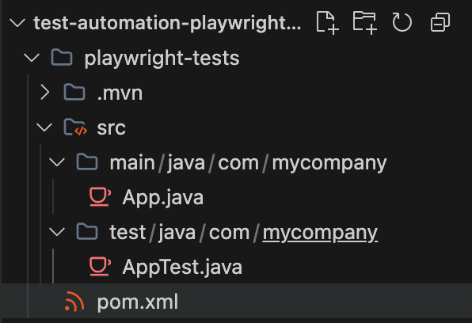
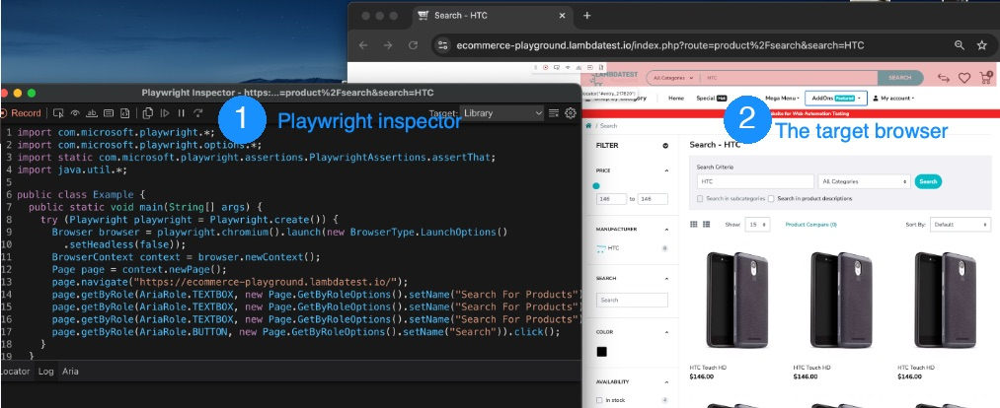

# Test Automation with Playwright Java: Step-by-Step Guide

For years, Java developers had to choose between traditional WebDriver-based tools like Selenium (which require manual explicit wait logic for every dynamic element), wrappers like Selenide, or splitting their tech stack to write browser tests in JavaScript. Playwright Java changes this, bringing driverless, auto-waiting browser testing natively to the Java ecosystem. 

This guide is a step-by-step roadmap to building a stable automation suite with Playwright Java. We will configure Playwright Java and JUnit 5, write resilient tests using web-first semantic locators, debug executions visually, and scale execution to a high-concurrency parallel cloud grid.

---

## What is Playwright Java?
Playwright Java is Microsoft’s library for automated end-to-end browser testing. It brings driverless browser automation directly to the Java ecosystem, allowing you to test uniformly across Chromium, Firefox, and WebKit, without managing external drivers like chromedriver or geckodriver.

Unlike Selenium's classic WebDriver protocol, which routes test commands through an intermediate driver executable (like chromedriver) that acts as a translator, Playwright establishes a direct WebSocket connection from your Java process straight to the browser's native debugging interface.

This direct, two-way channel allows Playwright to listen to live browser events such as DOM changes and network requests, enabling reliable auto-waiting and synchronization without the overhead of constant polling.

---

## Why should you choose Playwright Java?
Flaky test runs, slow executions, and complex configurations make browser-based testing difficult. For Java developers, migrating from legacy tools to Playwright provides these advantages:

- **Zero driver overhead:** Playwright manages its own sandboxed browser binaries automatically, eliminating the need to download, update, or path-match external webdrivers.
- **Native auto-waiting:** Playwright automatically checks that elements are actionable (visible, stable, and enabled) before performing clicks or keystrokes. This helps eliminate flaky tests caused by slow page rendering without requiring manual wait loops or `Thread.sleep()` statements.
- **Low-overhead browser contexts:** Playwright runs each test in a clean-state, isolated environment called a browser context (like an incognito tab). Each test gets its own cookies and local storage, ensuring that tests run independently and no failure is carried over to other tests.
- **Interactive code generation (codegen):** You can run Playwright codegen against any URL, and Playwright opens a browser alongside an inspector window. It records your interactions, generates resilient role-based locators, lets you add assertions for visibility or text, and records with emulation for specific viewports or devices.
- **Visual trace debugging:** Playwright's Trace Viewer records DOM snapshots, screenshots, console logs, and network requests for every test action. If a test fails, you can load the trace file and step backward and forward through the execution timeline to inspect the DOM state before and after each action.
- **Built-in network mocking:** Instead of configuring third-party mocking tools, you can use `page.route()` or `browserContext.route()` to intercept any HTTP request and choose to fulfill it with mock data, patch the real response before it reaches the page, or abort it entirely. This makes it easy to simulate API timeouts, mock API responses, or trigger 500 errors to see how your UI handles failures.

---

## How to set up Playwright Java?
To get Playwright running in a Java project, you need to add the dependency to your build tool and install the browser binaries. This tutorial uses Maven.

### Prerequisites
Before you begin, ensure your environment has:
- Java JDK 17 or higher (this guide was tested using JDK 23)
- An active Maven project with a `pom.xml` file in your project’s root directory. 

If you’re starting from scratch, you can initialize it in your IDE (like IntelliJ IDEA), or run this command in your terminal to generate a clean project directory instantly:

```bash
mvn archetype:generate -DgroupId=com.mycompany -DartifactId=playwright-tests -DarchetypeArtifactId=maven-archetype-quickstart -DarchetypeVersion=1.5 -DinteractiveMode=false
```

Your project should match this standard Maven directory structure:

```text
playwright-tests
├── pom.xml
└── src
    ├── main
    │   └── java
    │       └── com
    │           └── mycompany
    │               └── App.java
    └── src/test
        └── java
            └── com
                └── mycompany
                    └── AppTest.java
```

Ensure you are inside your project's root directory (`playwright-tests/`) before proceeding.

### Step 1. Installing the Playwright dependency (Maven)
Open your `pom.xml` and add the Playwright dependency to your `<dependencies>` block. This guide was tested against `1.60.0`. Playwright ships frequent releases, so check Maven Central for the latest version before starting a new project:

```xml
<dependency>
  <groupId>com.microsoft.playwright</groupId>
  <artifactId>playwright</artifactId>
  <version>1.60.0</version>
</dependency>
```

### Step 2. Install the browser binaries
By default, Playwright Java downloads the browser binaries automatically the first time you run your code (specifically, when calling `Playwright.create()`). However, downloading during test execution requires an active internet connection and can easily trigger test timeouts.

To avoid this, you can pre-download the binaries. The Maven Exec plugin lets you invoke Playwright’s bundled CLI tools directly through Maven, without needing any separate installation steps:

```bash
mvn exec:java -e -Dexec.mainClass=com.microsoft.playwright.CLI -Dexec.args="install"
```
This downloads the default Chromium, Firefox, and WebKit builds, and the `-e` flag ensures detailed error logs are printed if the download fails.

### Step 3. Verify the installation
To confirm the setup succeeded, we will write a simple smoke test. The code below launches a headless Chromium instance, navigates to the Playwright homepage, and checks the page title.

We will place this smoke test in `src/main/java` because it runs via a standard `main` method. Later in the guide, we will write our formal JUnit 5 test cases and place them in the `src/test/java` directory. 

Now, open `src/main/java/com/mycompany/App.java` (which was automatically created by Maven) and replace its contents with the code below: 

```java
package com.mycompany;

import com.microsoft.playwright.*;

public class App {
    public static void main(String[] args) {

        try (Playwright playwright = Playwright.create()) {
            // Launch a headless Chromium browser instance
            Browser browser = playwright.chromium().launch();

            // Open a new page (tab) within the browser
            Page page = browser.newPage();

            // Navigate to the Playwright homepage
            page.navigate("https://playwright.dev/");

            // Verify that the title contains 'Playwright' to ensure the page loaded
            // correctly
            if (!page.title().contains("Playwright")) {
                throw new RuntimeException(
                        "Smoke test failed! Title did not contain 'Playwright'. "
                                + "Current title: '" + page.title() + "'");
            }

            System.out.println("Smoke test passed successfully!");
        }
    }
}
```

Run the file via your terminal using this command:
```bash
mvn compile exec:java -Dexec.mainClass="com.mycompany.App"
```



If it prints “Smoke test passed successfully!” like in the image above, without throwing any exceptions to the console, your installation is fully verified and ready.

---

## How to write your first Playwright test in Java
While our smoke test verified that the installation works, a proper test suite relies on a testing framework like JUnit 5 to manage test lifecycles, group test cases, and run assertions. 

To demonstrate this, we will automate a search verification flow on an e-commerce sandbox:
1. Navigate to the sandbox homepage: `https://ecommerce-playground.lambdatest.io/`
2. Search for the product **"HTC"**
3. Verify that the search results header contains **"Search - HTC"** and the first product card contains the product **"HTC Touch HD"**

### Step 1: Add the JUnit 5 dependency
To write the test cases, add the `junit-jupiter` dependency to the `<dependencies>` block of your `pom.xml`. As with Playwright, check Maven Central for the current release. This guide uses `6.1.0`. 

```xml
<dependency>
    <groupId>org.junit.jupiter</groupId>
    <artifactId>junit-jupiter</artifactId>
    <version>6.1.0</version>
    <scope>test</scope>
</dependency>
```

Build your project or run `mvn test-compile` in your terminal to resolve and download the JUnit libraries. 

### Step 2: Set up the test lifecycle
To ensure optimal performance, Playwright distinguishes between the browser process and the browser context:
- **Browser:** The physical browser process (Chromium, Firefox, WebKit) launched by Playwright. Since starting a browser is resource-intensive, we launch it once before all tests run.
- **BrowserContext:** A lightweight, isolated session (similar to an incognito tab). We create a fresh context for each test case to guarantee complete session isolation without relaunching the browser.

We automate this lifecycle using JUnit 5 hooks (`@BeforeAll`, `@AfterAll`, `@BeforeEach`, and `@AfterEach`).

By default, JUnit 5 requires class-level setup methods to be `static`, which would force our shared `Browser` into a static field. To avoid that, we annotate our class with `@TestInstance(TestInstance.Lifecycle.PER_CLASS)` so JUnit can run standard instance-level hooks.

> [!WARNING]
> One tradeoff is that because the test class instance is now shared, class fields persist across tests, unlike `BrowserContext`, which resets every time. Avoid storing mutable test-specific state (like counters or temporary strings) in class variables, or state can leak between runs and cause flaky failures.

Create a file named `PlaywrightDemoTest.java` in `src/test/java/com/mycompany/` and add the following code:

```java
package com.mycompany;

import com.microsoft.playwright.*;
import org.junit.jupiter.api.*;

@TestInstance(TestInstance.Lifecycle.PER_CLASS)
public class PlaywrightDemoTest {
    private Playwright playwright;
    private Browser browser;

    private BrowserContext context;
    private Page page;

    @BeforeAll
    void launchBrowser() {
        playwright = Playwright.create();

        browser = playwright.chromium()
                .launch(new BrowserType.LaunchOptions()
                        .setHeadless(false));
    }

    @AfterAll
    void closeBrowser() {
        if (playwright != null) {
            playwright.close();
        }
    }

    @BeforeEach
    void createContextAndPage() {
        context = browser.newContext();
        page = context.newPage();
    }

    @AfterEach
    void closeContext() {
        if (context != null) {
            context.close();
        }
    }
}
```

### Step 3. Generate test code with Codegen
To speed up test authoring, Playwright includes a built-in code generator (Codegen) that records your browser interactions and drafts matching Java code. Codegen analyzes the DOM to prioritize resilient, user-facing locators (like ARIA roles and text) over CSS selectors.

To use Codegen, launch the generator via your terminal:
```bash
mvn exec:java -e -Dexec.mainClass=com.microsoft.playwright.CLI -Dexec.args="codegen https://ecommerce-playground.lambdatest.io/"
```

This will launch a browser window alongside the Playwright Inspector. In the browser window, perform a search flow (click the search bar, type “HTC”, and click search).



Once recorded, copy the generated locators to your clipboard and close the inspector.

#### Understanding the generated code
The code generated in the Playwright inspector will look similar to this:

```java
// ... boilerplate setup ...
page.navigate("https://ecommerce-playground.lambdatest.io/");

page.getByRole(AriaRole.TEXTBOX,
   new Page.GetByRoleOptions().setName("Search For Products")).click();

page.getByRole(AriaRole.TEXTBOX,
   new Page.GetByRoleOptions().setName("Search For Products")).fill("HTC");

page.getByRole(AriaRole.BUTTON,
   new Page.GetByRoleOptions().setName("Search")).click();
```

> [!NOTE]
> The code generated by codegen contains redundant browser setup boilerplate, records unnecessary actions (like clicks before typing), and lacks assertions. Because of this, Codegen is best used as a quick locator finder rather than a generator of complete tests.

We will extract just the core search locators and refine them in our JUnit class.

### Step 4. Write the refined test case
Now we will add our refined test case. First, add the required imports to the top of your `PlaywrightDemoTest.java` file:

```java
import com.microsoft.playwright.options.AriaRole;
import static com.microsoft.playwright.assertions.PlaywrightAssertions.assertThat;
```

We will verify results using Playwright's **Web-First Assertions** (`assertThat`), which are designed for live page state. Unlike JUnit 5's standard assertions (`assertEquals`, `assertTrue`), which evaluate a value once and fail immediately, locator-based assertions continuously re-evaluate the DOM condition until it passes or the 5-second default timeout is reached. This means if an element takes two seconds to render after a click, the assertion waits rather than failing.

We will also use JUnit 5's `@DisplayName` annotation to customize the human-readable test name displayed in reports.

Add this test method inside your `PlaywrightDemoTest` class:

```java
    @Test
    @DisplayName("Should search for a product and verify results")
    void shouldSearchAndFindProduct() {

        page.navigate("https://ecommerce-playground.lambdatest.io/");

        // Locate the search bar and type the product name
        page.getByPlaceholder("Search For Products")
                .first()
                .fill("HTC");

        // Click the search submit button
        page.getByRole(AriaRole.BUTTON,
                new Page.GetByRoleOptions().setName("Search"))
                .click();

        // Verify the search results header contains the query
        assertThat(page.locator("h1"))
                .containsText("Search - HTC");

        // Verify that the product link is visible in the search results
        assertThat(
                page.getByRole(AriaRole.LINK,
                        new Page.GetByRoleOptions().setName("HTC Touch HD"))
                        .first())
                .isVisible();
    }
```

### Running the test
You can run this test directly from your IDE or via the command line:

```bash
mvn test -Dtest=PlaywrightDemoTest
```


Because we configured the browser to run headed (`.setHeadless(false)`), you will see a Chromium window open, navigate to the e-commerce store, perform the search, and close automatically.

---

## How to debug Playwright Java tests
When your tests fail, you can diagnose them with Playwright using two main tools. 

### 1. Execution tracing (Trace viewer)
In Playwright, the tracing API can record DOM snapshots, network payloads, console warnings, and source code execution lines into a ZIP archive after the test completes, which is critical for analyzing failures, especially in a headless CI runner.

We will configure tracing by updating our JUnit 5 lifecycle hooks. Copy your existing `PlaywrightDemoTest.java` to a new file, `PlaywrightDebugDemoTest.java`, and rename the class to `PlaywrightDebugDemoTest`.

Now, replace the existing `createContextAndPage` and `closeContext` methods with these versions, which use JUnit's `TestInfo` parameter to generate a unique filename for each test trace:

```java
    @BeforeEach
    void createContextAndPage(TestInfo testInfo) {
        context = browser.newContext();
        // Start tracing before the test execution begins
        context.tracing().start(new Tracing.StartOptions()
                .setScreenshots(true)
                .setSnapshots(true)
                .setSources(true));
        page = context.newPage();
    }

    @AfterEach
    void closeContext(TestInfo testInfo) {
        if (context != null) {
            String className = testInfo
                    .getTestClass()
                    .map(Class::getSimpleName)
                    .orElse("Test");

            String safeDisplayName = testInfo
                    .getDisplayName()
                    .replaceAll("[^a-zA-Z0-9-]", "_");

            String safeName = className + "-" + safeDisplayName;

            context.tracing()
                    .stop(new Tracing.StopOptions()
                            .setPath(java.nio.file.Paths
                                    .get("target/trace-"
                                            + safeName + ".zip")));
            context.close();
        }
    }
```

Run the test with `mvn test -Dtest=PlaywrightDebugDemoTest` to capture the trace.

For local runs, the generated ZIP file (`trace-PlaywrightDebugDemoTest-Should_search_for_a_product_and_verify_results.zip`) will appear in your `target/` directory. Open it using the Playwright CLI:

```bash
mvn exec:java -e -Dexec.mainClass=com.microsoft.playwright.CLI -Dexec.args="show-trace target/trace-PlaywrightDebugDemoTest-Should_search_for_a_product_and_verify_results.zip"
```


Running the command opens the Trace Viewer—a web interface showing a visual timeline of your test, an action sidebar listing executed commands, interactive DOM snapshots showing states before/after each step, and detailed call logs, network requests, and console errors.

### 2. The Playwright inspector
While the trace viewer is designed for post-mortem analysis, the Playwright inspector is ideal for interactively stepping through code and testing locators in real-time on your local machine.

To launch the inspector, run your test suite with the `PWDEBUG` environment variable set. This automatically opens a headed browser and pauses execution at the first line of your test class:

- **macOS/Linux:** `PWDEBUG=1 mvn test -Dtest=PlaywrightDebugDemoTest`
- **PowerShell:** `$env:PWDEBUG="1"; mvn test -Dtest=PlaywrightDebugDemoTest`
- **CMD:** `set PWDEBUG=1 && mvn test -Dtest=PlaywrightDebugDemoTest`

---

## How to run Playwright Java tests in parallel with TestMu AI
Scaling tests usually means running them in parallel, but local machines hit resource limits quickly. Once your CPU saturates, adding more threads only slows the suite down.

TestMu AI (formerly LambdaTest) solves this by offloading browser execution to the cloud. While your local machine runs the JUnit test engine, the remote grid executes the browser processes over WebSockets. This lets you run tests concurrently up to your plan's session limit without local CPU or memory overhead.

### Step 1: Enable JUnit 5 parallel execution
Create a configuration file named `junit-platform.properties` in your `src/test/resources/` directory and add the following lines:

```properties
# Enable parallel test execution
junit.jupiter.execution.parallel.enabled = true

# Run both classes and methods concurrently
junit.jupiter.execution.parallel.mode.default = concurrent
junit.jupiter.execution.parallel.mode.classes.default = concurrent

# Scale thread count dynamically based on CPU cores
junit.jupiter.execution.parallel.config.strategy = dynamic
junit.jupiter.execution.parallel.config.dynamic.factor = 2.0
```

With `dynamic.factor = 2.0`, JUnit spawns parallel threads equal to twice your CPU core count. On an 8-core machine, that is 16 concurrent execution threads.

### Step 2: Connect Playwright to the cloud grid
To run tests in parallel, JUnit assigns each test to a separate execution thread.

However, Playwright objects (`Playwright`, `BrowserContext`, and `Page`) are not thread-safe and cannot be shared across threads. If two threads try to command the same `Page` instance at the same time, their instructions will clash and cause unpredictable failures. To prevent this, we must ensure thread isolation. 

We will create a new `TestMuDemoTest.java` class that uses a `@BeforeEach` hook to initialize a dedicated Playwright connection and page for each test.

Create a file named `TestMuDemoTest.java` in `src/test/java/com/mycompany/` and add the following code:

```java
package com.mycompany;

import com.microsoft.playwright.*;
import com.microsoft.playwright.options.AriaRole;
import org.junit.jupiter.api.*;
import org.junit.jupiter.api.extension.RegisterExtension;
import org.junit.jupiter.api.extension.TestWatcher;
import org.junit.jupiter.api.extension.ExtensionContext;
import java.nio.charset.StandardCharsets;
import java.net.URLEncoder;

import static com.microsoft.playwright.assertions.PlaywrightAssertions.assertThat;

public class TestMuDemoTest {
    private Playwright playwright;
    private Browser browser;
    private BrowserContext context;
    private Page page;

    // JUnit 5 TestWatcher to report status and clean up resources
    @RegisterExtension
    final TestWatcher watcher = new TestWatcher() {
        @Override
        public void testSuccessful(ExtensionContext context) {
            reportStatus("passed");
        }

        @Override
        public void testFailed(ExtensionContext context, Throwable cause) {
            reportStatus("failed");
        }

        private void reportStatus(String status) {
            System.out.println("--- STATUS REPORTED: " + status + " ---");
            try {
                if (page != null) {
                    String action = String.format(
                            "lambdatest_action: {\"action\": \"setTestStatus\", "
                                    + "\"arguments\": {\"status\":\"%s\"}}",
                            status);
                    page.evaluate("_ => {}", action);
                }
            } finally {
                // Ensure browser resources close cleanly
                if (TestMuDemoTest.this.context != null) {
                    TestMuDemoTest.this.context.close();
                }
                if (TestMuDemoTest.this.playwright != null) {
                    TestMuDemoTest.this.playwright.close();
                }
            }
        }
    };

    @BeforeEach
    void setUp(TestInfo testInfo) {
        String username = System.getenv("LT_USERNAME");
        String accessKey = System.getenv("LT_ACCESS_KEY");

        if (username == null || accessKey == null) {
            throw new IllegalStateException(
                    "Missing LT_USERNAME or LT_ACCESS_KEY environment variables.");
        }

        playwright = Playwright.create();
        String testName = testInfo.getDisplayName();

        String capabilities = """
                {
                    "browserName": "Chrome",
                    "browserVersion": "latest",
                    "LT:Options": {
                        "platform": "Windows 10",
                        "project": "E-commerce automation",
                        "build": "Playwright Java parallel build",
                        "name": "%s",
                        "user": "%s",
                        "accessKey": "%s",
                        "video": true,
                        "network": true,
                        "console": true
                    }
                }
                """.formatted(testName, username, accessKey);

        try {
            String capsEncoded = URLEncoder.encode(
                    capabilities,
                    StandardCharsets.UTF_8.toString());
            String connectUrl = "wss://cdp.lambdatest.com/playwright?"
                    + "capabilities=" + capsEncoded;

            browser = playwright.chromium().connect(connectUrl);
            context = browser.newContext();
            page = context.newPage();
        } catch (Exception e) {
            if (playwright != null) {
                playwright.close();
            }
            throw new RuntimeException(
                    "Failed to connect to TestMu AI grid. Verify credentials, "
                            + "CDP URL, and concurrent limits on your dashboard.",
                    e);
        }
    }

    @Test
    @DisplayName("Should search for a product and verify results on the cloud grid")
    void shouldSearchAndFindProduct() {
        page.navigate("https://ecommerce-playground.lambdatest.io/");

        // Locate search bar and fill query
        page.getByPlaceholder("Search For Products").first().fill("HTC");

        // Click search button
        page.getByRole(AriaRole.BUTTON, new Page.GetByRoleOptions()
                .setName("Search")).click();

        // Assertions
        assertThat(page.locator("h1")).containsText("Search - HTC");

        assertThat(page.getByRole(AriaRole.LINK, new Page.GetByRoleOptions()
                .setName("HTC Touch HD")).first()).isVisible();
    }
}
```

This setup guarantees thread safety by instantiating Playwright and calling `connect()` within each test’s `@BeforeEach` cycle. 

- **Grid capabilities configuration:** To configure the remote execution environment, we define a JSON capabilities block specifying the target OS, browser, and debugging parameters (like video recording, capturing browser console logs, and logging network activity). 
- **Result reporting (JUnit 5 Extension):** Because our JUnit assertions run locally while browser rendering runs in the cloud, the grid cannot read our local test outcomes. We bridge this gap by using the `@RegisterExtension` annotation to register a JUnit 5 `TestWatcher`. This watcher intercepts the test result and runs a JavaScript action (`lambdatest_action`) to update the cloud dashboard status before cleanly closing all browser resources.

### Step 3. Run the parallel suite
Before launching the test run, set your authentication credentials in your terminal. 

For **macOS/Linux**:
```bash
export LT_USERNAME="your_username"
export LT_ACCESS_KEY="your_access_key"
```

For **Windows**:
```powershell
$env:LT_USERNAME="your_username"
$env:LT_ACCESS_KEY="your_access_key"
```

Now, run your test suite using Maven: 
```bash 
mvn test 
```
Once you execute the command, JUnit initializes parallel execution threads locally. Each thread connects to the TestMu AI grid, prompting the cloud platform to spin up dedicated virtual machines to run your tests simultaneously. 


You can monitor the real-time execution, video streams, and console logs directly from the TestMu AI Automation Dashboard.

---

## Conclusion
Traditional browser test suites often suffer from slow runs, complex configurations, and flaky execution. By migrating to Playwright Java and JUnit 5, you eliminate driver-matching overhead and write resilient, web-first tests using semantic locators.

In this guide, we built a modern automation project from scratch, verified locator logic locally using execution traces, and scaled our suite to the TestMu AI cloud grid to run high-concurrency parallel runs with automated status reporting. Transitioning to this modern testing stack dramatically accelerates your overall test execution speed, reduces the debugging loop, and ensures your assertions remain highly stable and reliable.

---

## Frequently asked questions (FAQs)

#### Can I share a single Browser instance across tests in parallel?
No, Playwright objects are not thread-safe and will cause state collisions. For parallel runs, always launch an isolated Playwright and Browser connection per thread inside your `@BeforeEach` hook.

#### How do I change the browser dynamically in Playwright Java CLI?
Read a system property in your Java setup code and parameterize your Maven execution:

```java
String targetBrowser = System.getProperty("grid.browser", "Chrome");
```
Run the suite targeting a specific browser: `mvn test -Dgrid.browser=Firefox`

#### How do I mock API responses in Playwright Java?
Use Playwright's routing API to intercept network requests and return custom mock JSON payloads:

```java
page.route("**/api/products", r -> r.fulfill(new Route.FulfillOptions()
    .setStatus(200).setContentType("application/json")
    .setBody("[{\"id\":1,\"name\":\"Mocked\"}]")));
```
