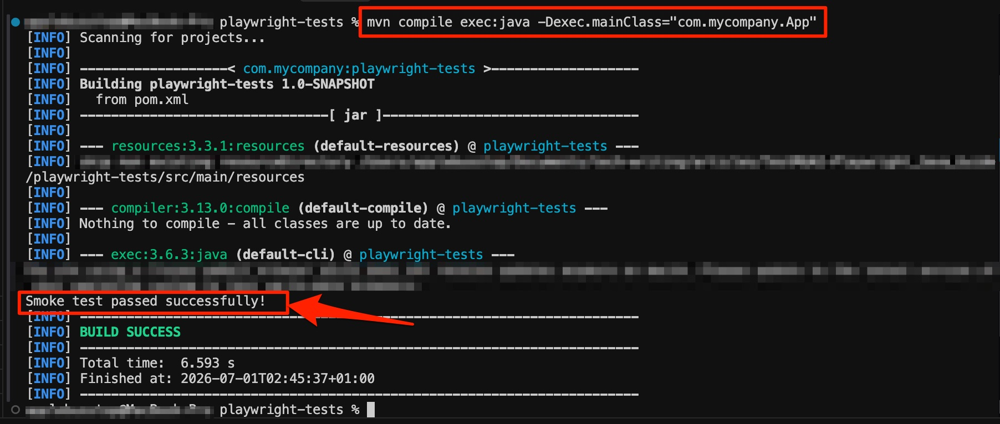
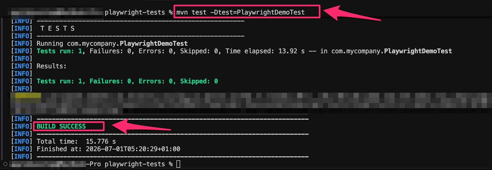
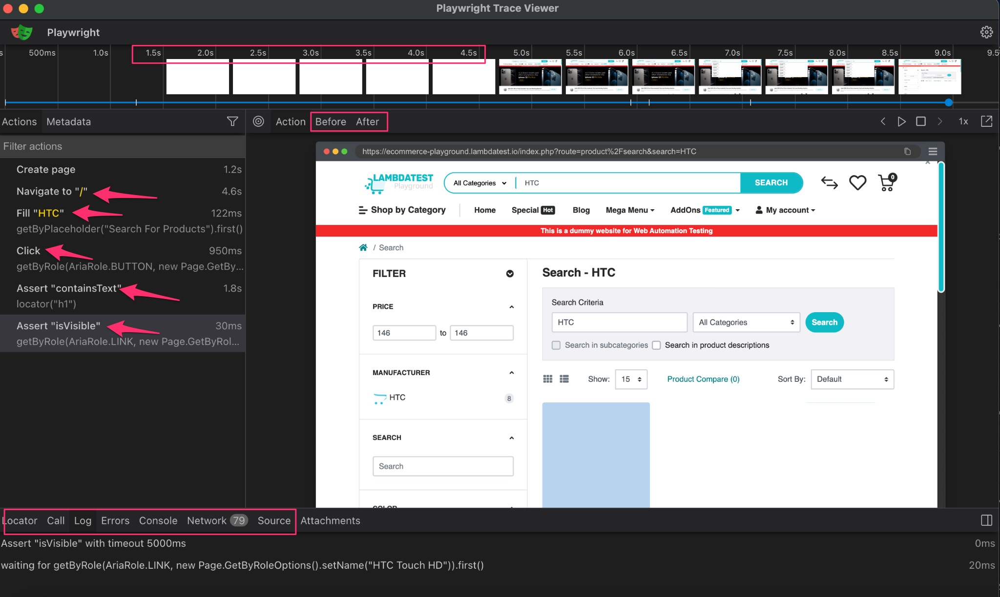
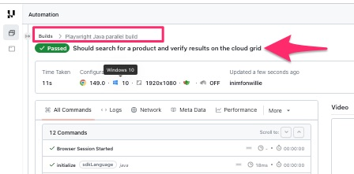

# Test Automation with Playwright Java & LambdaTest Integration

This repository contains the companion code for the step-by-step tutorial: **"Test Automation with Playwright Java: Step-by-Step Guide"**. It demonstrates how to build stable, parallel-ready Java automation tests using Microsoft Playwright, JUnit 5, and the TestMu AI (LambdaTest) cloud grid.

---

## 📋 Table of Contents

- [Getting Started](#-getting-started)
  - [Prerequisites](#prerequisites)
  - [Setup](#setup)
  - [Install Browsers](#install-browsers)
- [Project Execution: Local vs Cloud](#-project-execution-local-vs-cloud)
  - [1. Installation Verification (Smoke Test)](#1-installation-verification-smoke-test)
  - [2. Local Test Execution](#2-local-test-execution)
  - [3. Debug Mode with Playwright Tracing](#3-debug-mode-with-playwright-tracing)
  - [4. Interactive Debugging with Inspector](#4-interactive-debugging-with-inspector)
  - [5. Concurrency & Parallel Execution on the Cloud](#5-concurrency--parallel-execution-on-the-cloud)
- [🏗️ Project Structure](#️-project-structure)
- [📊 Test Execution Results](#-test-execution-results)
- [🔗 Useful Resources](#-useful-resources)

---

## 📋 Getting Started

### Prerequisites
Before getting started, make sure you have the following installed on your machine:
- **Java JDK 17** or higher (tested on JDK 23)
- **Apache Maven** 3.8+
- **Git**
- **TestMu AI (LambdaTest)** account ([sign up for free](https://www.lambdatest.com?fp_ref=inimfonwillie))

### Setup
1. **Clone the repository:**
   ```bash
   git clone https://github.com/proGabby/playwright-java-test-automation.git
   cd test-automation-playwright-java
   ```

2. **Navigate to the test project root:**
   ```bash
   cd playwright-tests
   ```

### Install Browsers
Download the required Playwright browser binaries (Chromium, Firefox, and WebKit) using the Playwright CLI tool:
```bash
mvn exec:java -e -Dexec.mainClass=com.microsoft.playwright.CLI -Dexec.args="install"
```

---

## 🏗️ Project Structure

```text
.
├── docs/
│   └── images/                       # Tutorial screenshots
├── playwright-tests/
│   ├── pom.xml                       # Maven configuration & dependencies
│   ├── src/
│   │   ├── main/java/com/mycompany/
│   │   │   └── App.java              # Local browser smoke test
│   │   └── test/
│   │       ├── java/com/mycompany/
│   │       │   ├── PlaywrightDemoTest.java       # Standard local test
│   │       │   ├── PlaywrightDebugDemoTest.java  # Trace-enabled test
│   │       │   └── TestMuDemoTest.java           # Cloud grid parallel test
│   │       └── resources/
│   │           └── junit-platform.properties     # Parallel execution config
│   └── target/                       # Maven compilation & trace outputs (Git ignored)
└── .gitignore                        # Git ignore file (excludes target/)
```

---


## 🧪 Project Execution: Local vs Cloud

### 1. Installation Verification (Smoke Test)
Run the simple smoke test defined in [`App.java`](playwright-tests/src/main/java/com/mycompany/App.java) to ensure Playwright correctly launches and communicates with a headless browser locally:

```bash
mvn compile exec:java -Dexec.mainClass="com.mycompany.App"
```



---

### 2. Local Test Execution (`PlaywrightDemoTest.java`)
Execute the standard search verification test case locally against the LambdaTest e-commerce playground:

```bash
mvn test -Dtest=PlaywrightDemoTest
```
* **Execution:** A headed Chromium browser will launch, perform a search query for "HTC", verify the results, and automatically close.



---

### 3. Debug Mode with Playwright Tracing (`PlaywrightDebugDemoTest.java`)
Run the tracing suite to record screenshots, snapshots, and sources into a ZIP archive for visual post-mortem analysis:

```bash
mvn test -Dtest=PlaywrightDebugDemoTest
```

Once the test completes, view the visual execution timeline in the Playwright Trace Viewer:
```bash
mvn exec:java -e -Dexec.mainClass=com.microsoft.playwright.CLI -Dexec.args="show-trace target/trace-PlaywrightDebugDemoTest-Should_search_for_a_product_and_verify_results.zip"
```

**Trace Viewer Interface:**


---

### 4. Interactive Debugging with Inspector
To step through your tests line-by-line and test locators in real-time, execute the test with the `PWDEBUG` flag set:

- **macOS/Linux:**
  ```bash
  PWDEBUG=1 mvn test -Dtest=PlaywrightDebugDemoTest
  ```
- **Windows (PowerShell):**
  ```powershell
  $env:PWDEBUG="1"; mvn test -Dtest=PlaywrightDebugDemoTest
  ```

---

### 5. Parallel Execution on the Cloud (TestMu AI Grid) (`TestMuDemoTest.java`)
JUnit 5 parallel execution is configured in [`junit-platform.properties`](playwright-tests/src/test/resources/junit-platform.properties). It runs tests concurrently on the TestMu AI cloud grid.

Set up your LambdaTest access credentials in your terminal:
- **macOS/Linux:**
  ```bash
  export LT_USERNAME="your_username"
  export LT_ACCESS_KEY="your_access_key"
  ```
- **Windows (PowerShell):**
  ```powershell
  $env:LT_USERNAME="your_username"
  $env:LT_ACCESS_KEY="your_access_key"
  ```

Run all tests in parallel on the cloud grid:
```bash
mvn test
```

---

## 📊 Test Execution Results

### Local Test Output
The local tests execution results in the terminal:


### LambdaTest Cloud Grid Dashboard
Review test video recording playback, network timelines, and console logs from the grid:


---

## 🔗 Useful Resources

- [Official Playwright Java Documentation](https://playwright.dev/java/docs/intro)
- [JUnit 5 User Guide](https://junit.org/junit5/docs/current/user-guide/)
- [LambdaTest Automation Grid Capabilities Generator](https://www.lambdatest.com/capabilities-generator/)
- [Playwright Trace Viewer Docs](https://playwright.dev/java/docs/trace-viewer)

---

## 🚀 Ready to Master Playwright Java?

1. **Clone this repository**
2. **Follow the tutorial guide to set up local tests**
3. **Connect to TestMu AI Grid and scale execution**
4. **Happy Testing!** 🎭
